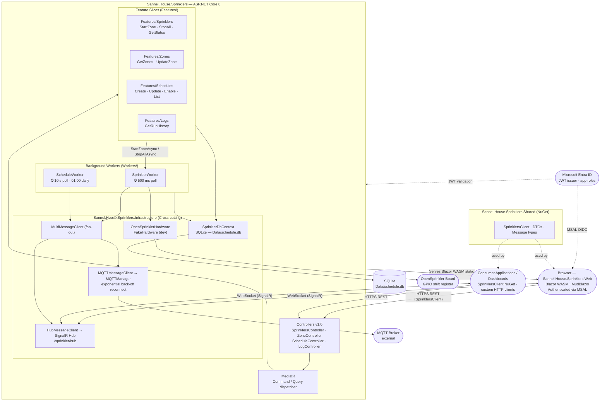
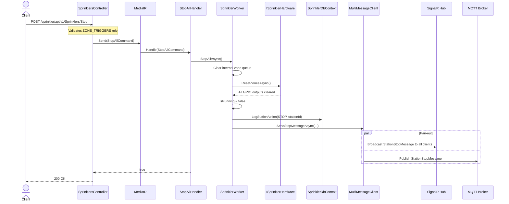
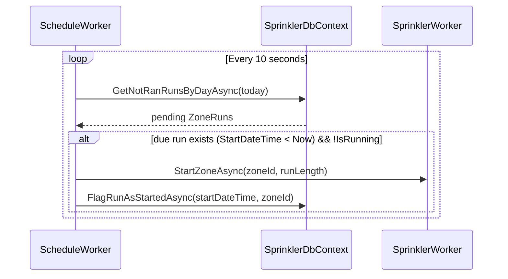
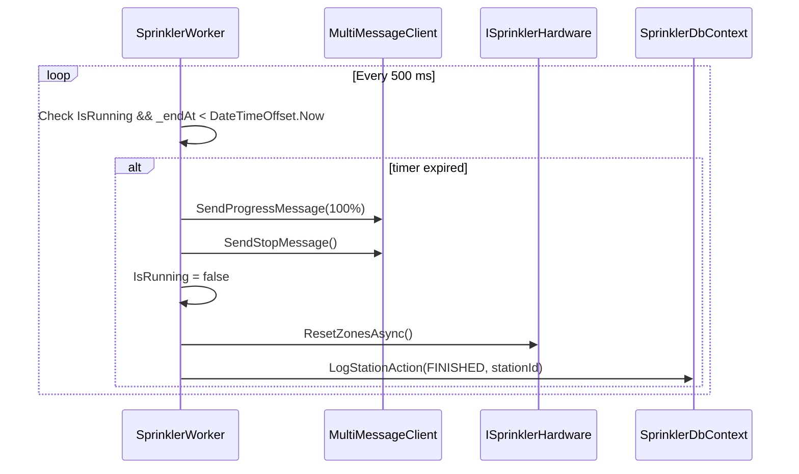
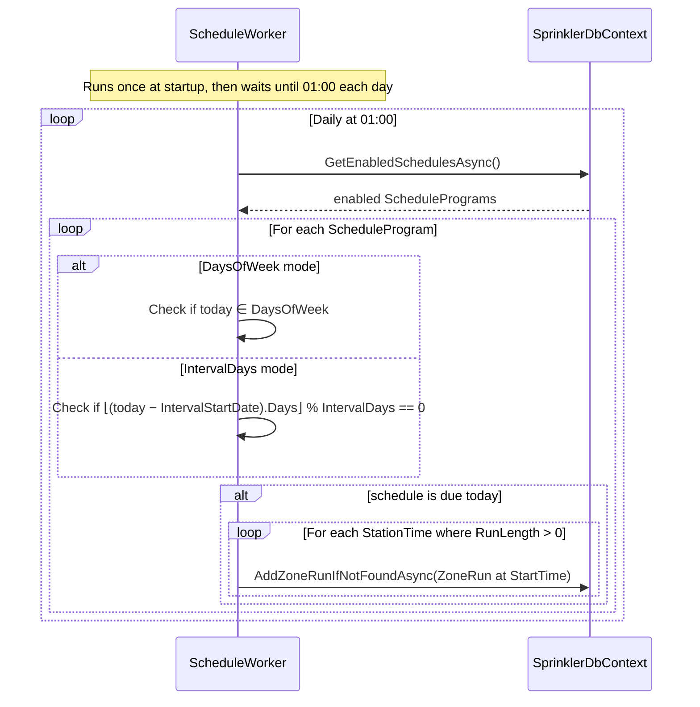

# Architecture Document: Sannel.House.Sprinklers

## Document Info

| Field        | Value                        |
|---|---|
| Version      | 1.0                          |
| Status       | Draft                        |
| Author       | Sannel Software, L.L.C.      |
| Last Updated | 2026-05-09                   |

---

## Overview

Sannel.House.Sprinklers is a self-hosted ASP.NET Core 8 Web API that controls a residential irrigation system running on a Raspberry Pi. It manages GPIO-driven sprinkler zones, executes day-of-week and interval-based watering schedules, and fans real-time events out over both SignalR and MQTT. Configuration, scheduling, and zone metadata are persisted in a local SQLite database.

The system is distributed as a multi-architecture Docker image (`linux/amd64`, `linux/arm64`) and as a self-contained single-file binary for bare-metal Raspberry Pi deployment.

The backend is structured using **Vertical Slice Architecture (VSA)**: business logic is organized into feature slices under `Features/` (each slice contains its own MediatR commands/queries, handlers, and response types), with cross-cutting infrastructure kept in `Sannel.House.Sprinklers.Infrastructure`. Background workers (`SprinklerWorker`, `ScheduleWorker`) live under `Workers/` alongside their corresponding feature slices.

---

## Goals & Non-Goals

### Goals

- Provide a versioned, JWT-secured REST API for zone control, scheduling, and history retrieval.
- Execute automated watering schedules derived from day-of-week or interval-based patterns without cloud dependency.
- Fan real-time zone events to SignalR clients and an MQTT broker simultaneously.
- Abstract GPIO hardware behind an interface so the service runs on non-Pi hosts using a fake driver.
- Ship a typed .NET client NuGet package (`Sannel.House.Sprinklers.Shared`) for consumer applications.

### Non-Goals

- Multi-zone concurrent activation (only one zone runs at a time by design).
- Weather-aware scheduling adjustments.
- Managing the MQTT broker or the Azure AD tenant.
- Providing a general-purpose smart home or multi-site irrigation management platform.

---

## System Context

Sannel.House.Sprinklers sits at the edge of the Sannel House home automation network, directly attached to GPIO hardware. External systems that interact with it are:

| External System        | Interaction                                                        |
|---|---|
| **Microsoft Entra ID** | Issues JWT bearer tokens; defines app roles for authorization      |
| **MQTT Broker**        | Receives zone start/stop/progress/zone-update event publications   |
| **Browser Users**      | Interact with the Blazor WASM management UI served by the API host |
| **Consumer Apps**      | Call the REST API and connect to the SignalR hub using `SprinklersClient` |
| **OpenSprinkler Board**| Receives zone enable/disable signals via Raspberry Pi GPIO shift registers |
| **Docker / Host OS**   | Provides the container runtime, volume mounts, and GPIO device access |

---

## Architecture Diagram



---

## Components & Services

### Sannel.House.Sprinklers (Web API Host + Feature Slices)

- **Responsibility:** ASP.NET Core application host. Wires DI container, configures authentication/authorization, registers background workers, exposes Swagger UI, maps the SignalR hub route, and starts the MQTT connection. Business logic is organized as feature slices under `Features/`; controllers dispatch to MediatR rather than calling services directly.
- **Technology:** ASP.NET Core 8 (`net8.0`), `Microsoft.NET.Sdk.Web`, MediatR 12.x
- **Key registrations:**
  - `MediatR` — registered via `AddMediatR` scanning the `Features/` and `Workers/` assemblies.
  - `SprinklerWorker` — registered as both `AddSingleton<SprinklerWorker>` and `AddHostedService<SprinklerWorker>` so it is injectable by feature handlers.
  - `ScheduleWorker` — registered via `AddHostedService<ScheduleWorker>`.
  - `MultiMessageClient` — registered as `IMessageClient` singleton, wrapping `HubMessageClient` and `MQTTMessageClient`.
  - `SprinklerDbContext` — `AddDbContext` with SQLite connection string `Data Source=Data/schedule.db`.
  - Hardware driver — `OpenSprinklerHardware` if `/dev/gpiomem` exists, otherwise `FakeHardware`, both as `ISprinklerHardware` singleton.
- **Interfaces:** HTTP REST (`/sprinkler/api/v{version}/`), WebSocket SignalR hub (`/sprinkler/hub`), Swagger UI (`/sprinkler/swagger`)
- **Configuration loaded from:**
  1. `appsettings.json` (embedded defaults)
  2. `appsettings.{Environment}.json`
  3. `app_config/appsettings.json` (Docker volume mount — overrides)
  4. `app_config/appsettings.{Environment}.json`

---

### Feature Slices — `Features/` (inside `Sannel.House.Sprinklers`)

- **Responsibility:** Each feature slice owns all the logic for one business capability: MediatR command and/or query request classes, a handler, and response types. Handlers receive their dependencies (including `SprinklerDbContext` and `SprinklerWorker`) via DI — there are no repository interfaces.
- **Technology:** .NET 8; MediatR 12.x; Riok.Mapperly for source-generated object mapping.
- **Feature areas:**

| Feature | Commands / Queries | Notes |
|---|---|---|
| `Features/Sprinklers` | `EnqueueZonesCommand`, `StopAllCommand`, `GetStatusQuery` | Handlers call `SprinklerWorker` (injected singleton) for live zone control; `EnqueueZonesCommand` accepts a list of zone+duration pairs |
| `Features/Zones` | `GetZonesQuery`, `GetZoneByIdQuery`, `UpdateZoneCommand` | Handlers read/write `ZoneMetaData` via `SprinklerDbContext`; send `ZoneUpdateMessage` via `IMessageClient` |
| `Features/Schedules` | `CreateScheduleCommand`, `UpdateScheduleCommand`, `EnableScheduleCommand`, `GetSchedulesQuery`, `GetScheduleByIdQuery` | Handlers read/write `ScheduleProgram` via `SprinklerDbContext` |
| `Features/Logs` | `GetRunHistoryQuery` | Handlers query `StationLog` joined with `ZoneMetaData` via `SprinklerDbContext` |

### Background Feature Workers — `Workers/` (inside `Sannel.House.Sprinklers`)

- **Responsibility:** Long-running `BackgroundService` implementations that own their domain's background processing loop. Each worker is co-located with its corresponding feature slice and is treated as a feature worker in the VSA sense.

| Type | Role |
|---|---|
| `SprinklerWorker` | `BackgroundService` — 500 ms polling loop. Tracks active zone timer (`_endAt`). Sends `StationStartMessage`, `StationProgressMessage`, `StationStopMessage` via `IMessageClient`. Calls `ISprinklerHardware` and writes to `SprinklerDbContext` directly. Maintains an internal `Queue<(byte ZoneId, TimeSpan Length)>` for manual zone runs; when the current zone finishes, the next queued item starts automatically. Exposes `EnqueueZonesAsync(IEnumerable<(byte ZoneId, TimeSpan Length)>)` for `Features/Sprinklers` handlers. Registered as both `AddSingleton<SprinklerWorker>` and `AddHostedService<SprinklerWorker>` so feature handlers can inject it. |
| `ScheduleWorker` | `BackgroundService` — 10 s polling loop dispatches due `ZoneRun` records. A separate `Task`-returning generation method with `CancellationToken` support regenerates daily runs at 01:00 by evaluating each `ScheduleProgram`'s day-of-week set or interval-in-days pattern against the current date. Unhandled exceptions propagate to the host rather than being silently swallowed. Uses `SprinklerDbContext` directly. |
| `IMessageClient` | Fan-out interface: `SendStartMessageAsync`, `SendStopMessageAsync`, `SendProgressMessageAsync`, `SendZoneUpdateMessageAsync`. |

### Sannel.House.Sprinklers.Infrastructure (Cross-cutting Infrastructure)

- **Responsibility:** Cross-cutting infrastructure concerns shared across all feature slices: EF Core DbContext and migrations, GPIO drivers, SignalR hub, MQTT client management, and messaging fan-out. Feature handlers and workers access `SprinklerDbContext` directly via DI — no repository interfaces are defined here.
- **Technology:** .NET 8 class library; ASP.NET Core framework reference (for SignalR); `Microsoft.EntityFrameworkCore.Sqlite` 8.0.6; `Iot.Device.Bindings` 3.2.0; `System.Device.Gpio` 3.2.0; `MQTTnet` 4.3.6.1152.

| Type | Role |
|---|---|
| `SprinklerDbContext` | EF Core `DbContext` with `ScheduleProgram`, `StationLog`, `ZoneRun`, `ZoneMetaData` entity sets. Applies `DateTimeOffsetToBinaryConverter` for all `DateTimeOffset` properties (SQLite limitation). Stores `ScheduleProgram.StationTimes` and `ScheduleProgram.DaysOfWeek` as JSON columns. Accessed directly by feature handlers and workers — no repository layer. |
| `ISprinklerHardware` | Interface abstracting GPIO zone control (`TurnZoneOnAsync`, `ResetZonesAsync`, `Zones`, `State`). |
| `OpenSprinklerHardware` | Drives a 74HC595-style shift register via four GPIO pins (OE: 17, DATA: 27, CLOCK: 4, LATCH: 22) using `System.Device.Gpio` and `Iot.Device.Board`. Zone count read from `Sprinkler:Zones` config. Only one zone is active at a time. |
| `FakeHardware` | In-memory `ISprinklerHardware` stub. Used on non-Pi hosts. All operations are no-ops. Reads zone count from `Sprinkler:Zones` config (consistent with `OpenSprinklerHardware`). |
| `MessageHub` | Empty `SignalR Hub` class. Hub methods are not exposed — the hub is server-push only (infrastructure sends messages, clients subscribe). |
| `HubMessageClient` | `IMessageClient` implementation. Publishes messages to all SignalR clients using `IHubContext<MessageHub>` with event names from `EventNames`. |
| `MQTTMessageClient` | `IMessageClient` implementation. Serializes messages to JSON and publishes to MQTT topics under `Sannel/House/Sprinklers/{EventName}`. Errors are caught and logged; failures do not interrupt zone operation. |
| `MultiMessageClient` | Composite `IMessageClient`. Calls all registered clients in parallel via `Task.WhenAll`. |
| `MQTTManager` | Manages the `MQTTnet` client lifecycle: initial connection, TLS (with custom CA certificate chain), credentials, and disconnection recovery. Reconnect uses exponential back-off doubling from 250 µs, capped at 30 s. Exposes `StartAsync()` and `PublishAsync()`. |

---

### Sannel.House.Sprinklers.Shared (NuGet Package)

- **Responsibility:** Contains all types shared between the service and its consumers. Published as a NuGet package. Referenced by Core and Infrastructure for message types.
- **Technology:** .NET 8 class library; `Microsoft.AspNetCore.SignalR.Client` 8.0.6; Source Link (GitHub).
- **Key types:**

| Type | Role |
|---|---|
| `SprinklersClient` | Typed HTTP + SignalR client. `V1` nested class provides strongly-typed methods for all v1 API endpoints and exposes `StationStart`, `StationStop`, `StationProgress`, `ZoneUpdate` events from the SignalR hub. |
| `SprinklerClientOptions` | Configuration POCO. **`HostUri`** must be set to the service base URL including the `/sprinkler` path prefix — e.g., `https://rpi.local:8080/sprinkler`. The client appends API paths (`/api/v1/Zone`, `/api/v1/Sprinklers/Start`, etc.) and the hub path (`/hub`) directly to this value. Omitting the prefix will produce silent `HTTP 404` errors on all calls. |
| `Result<T>` / `Result` | HTTP call result wrapper exposing `IsSuccess`, `StatusCode`, and `Value`. |
| `StatusDto` | Sprinkler system status: `IsRunning`, `TimeLeft`, `TotalTime`, `Zones`, `ZoneInfo`, `QueuedZoneCount`. |
| `ZoneInfoDto` | Zone metadata: `ZoneId`, `Name`, `Color`. |
| `ScheduleProgramDto` / `NewScheduleDto` / `UpdateScheduleDto` | Schedule request/response shapes. |
| `ZoneStartRequestDto` | Zone start queue item: `ZoneId` and `Length`. Used as the body for `POST /Start`. |
| `StationTimeDto` | Zone ID and run length within a schedule. |
| `StationStartMessage` | Real-time start event: `ZoneId`, `Duration`, `StartTime`, `TriggerTime`. |
| `StationStopMessage` | Real-time stop event: `ZoneId`, `StopTime`, `TriggerTime`. |
| `StationProgressMessage` | Real-time progress tick: `ZoneId`, `RunLength`, `TimeLeft`, `PercentCompleteFloat`, `PercentComplete`, `InvertPercentComplete`, `TriggerTime`. |
| `ZoneUpdateMessage` | Zone metadata change notification: `ZoneInfo`, `UpdateTime`. |
| `EventNames` | Constants: `ProgressMessage`, `StartMessage`, `StopMessage`, `ZoneUpdate`. |

---

### Sannel.House.Sprinklers.Web (Blazor WASM Client)

- **Responsibility:** Browser-based management UI. Provides authenticated access to all system features: real-time zone status dashboard, manual zone start/stop, schedule program management, zone metadata editing, and run history viewer.
- **Technology:** Blazor WebAssembly (ASP.NET Core hosted model), MudBlazor (Material Design component library), `Microsoft.Authentication.WebAssembly.Msal` for Azure AD authentication.
- **Hosting:** Compiled to WebAssembly and served as static assets (`_framework/`, `wwwroot/`) by the `Sannel.House.Sprinklers` API host. No separate server process is required.
- **API integration:** Uses `SprinklersClient` from `Sannel.House.Sprinklers.Shared` for all REST API calls and SignalR event subscriptions.
- **Authentication:** Authenticates via Azure AD using MSAL for Blazor WASM (`Microsoft.Authentication.WebAssembly.Msal`). The access token is injected into all outgoing API requests via a delegating handler. The same app registration and role assignments used by the REST API are reused.
- **Real-time updates:** Subscribes to `StationStart`, `StationStop`, `StationProgress`, and `ZoneUpdate` events via `SprinklersClient` SignalR integration, updating the zone status dashboard in real time without polling.
- **Interfaces:** Served from the API host root; all API calls are same-origin (no CORS required for the Blazor client itself).

---

## API Design

All routes are prefixed `/sprinkler/api/v{version}/` (currently `v1.0`). All endpoints require a valid Azure AD JWT bearer token.

### SprinklersController — `/sprinkler/api/v1/Sprinklers`

| Method | Route       | Auth Policy          | Description                            |
|---|---|---|---|
| `POST` | `/Start`    | `ZONE_TRIGGERS`      | Enqueue one or more zones to run sequentially. Accepts `IEnumerable<ZoneStartRequestDto>` body (each item: `ZoneId`, `Length`). Appends to the queue if a zone is already running. Returns `bool`. |
| `POST` | `/Stop`     | `ZONE_TRIGGERS`      | Stop all zones immediately. Returns `bool`. |
| `GET`  | *(base)*    | `ZONE_READERS`       | Get current system status (`StatusDto`). |

### ZoneController — `/sprinkler/api/v1/Zone`

| Method | Route  | Auth Policy            | Description                                   |
|---|---|---|---|
| `GET`  | *(base)* | `ZONE_METADATA_READER` | Get all zone metadata (`IEnumerable<ZoneInfoDto>`). |
| `GET`  | `/{id}`  | `ZONE_METADATA_READER` | Get zone metadata by ID. 404 if not found.   |
| `PUT`  | *(base)* | `ZONE_METADATA_WRITER` | Create or update zone metadata (`ZoneInfoDto` body). |

### ScheduleController — `/sprinkler/api/v1/Schedule`

| Method | Route                        | Auth Policy           | Description                                     |
|---|---|---|---|
| `GET`  | *(base)*                     | `SCHEDULE_READERS`    | Get all schedule programs.                      |
| `GET`  | `/{id}`                      | `SCHEDULE_READERS`    | Get schedule by GUID. 404 if not found.         |
| `POST` | *(base)*                     | `SCHEDULE_SCHEDULERS` | Create a new schedule (`NewScheduleDto`). Returns new GUID. |
| `PUT`  | *(base)*                     | `SCHEDULE_SCHEDULERS` | Update an existing schedule (`UpdateScheduleDto`). Returns GUID. |
| `PUT`  | `/{scheduleId}/{isEnable}`   | `SCHEDULE_SCHEDULERS` | Enable (`true`) or disable (`false`) a schedule. |

### LogController — `/sprinkler/api/v1/Log`

| Method | Route               | Auth Policy    | Description                                                          |
|---|---|---|---|
| `GET`  | `/Runs/{from}/{to}` | `ZONE_READERS` | Get station run log entries between `from` and `to` (`DateOnly`). `from` must be ≤ `to`. |

### SignalR Hub — `/sprinkler/hub`

Server-push only. Clients subscribe to events; the server never expects hub method calls.

| Event Name         | Message Type             | Trigger                              |
|---|---|---|
| `StartMessage`     | `StationStartMessage`    | Zone activated (`SprinklerWorker.StartZoneAsync`) |
| `StopMessage`      | `StationStopMessage`     | Zone stopped manually (`POST /Stop`) or by timer expiry. |
| `ProgressMessage`  | `StationProgressMessage` | Every 500 ms while a zone is running |
| `ZoneUpdate`       | `ZoneUpdateMessage`      | Zone metadata updated via `UpdateZoneCommand` handler in `Features/Zones` |

### MQTT Topics

Published by `MQTTMessageClient` using JSON-serialized payloads.

| Topic                                    | Message Type             |
|---|---|
| `Sannel/House/Sprinklers/StartMessage`   | `StationStartMessage`    |
| `Sannel/House/Sprinklers/StopMessage`    | `StationStopMessage`     |
| `Sannel/House/Sprinklers/ProgressMessage`| `StationProgressMessage` |
| `Sannel/House/Sprinklers/ZoneUpdate`     | `ZoneUpdateMessage`      |

---

## Data Models

### ScheduleProgram

| Property       | Type                          | Notes                                     |
|---|---|---|
| `Id`                | `Guid` (PK)                     | Auto-generated on creation                                  |
| `Name`              | `string`                        | User-defined display name                                   |
| `StartTime`         | `TimeOnly`                      | Time of day to begin watering (required)                    |
| `DaysOfWeek`        | `ICollection<DayOfWeek>?`       | Days on which to run; null when interval mode is used. Stored as a JSON column. |
| `IntervalDays`      | `int?`                          | Number of days between runs; null when day-of-week mode is used |
| `IntervalStartDate` | `DateOnly?`                     | Anchor date for interval calculation; required when `IntervalDays` is set. Due when `⌊(today − IntervalStartDate).Days⌋ % IntervalDays == 0`. |
| `Enabled`           | `bool`                          | Controls whether schedule generates daily runs              |
| `StationTimes`      | `ICollection<StationTime>`      | Per-zone run durations; stored as a JSON column in SQLite   |

> **Constraint:** Exactly one of `DaysOfWeek` or `IntervalDays` must be non-null per `ScheduleProgram`. Setting both or neither is invalid.

### StationTime

| Property    | Type       | Notes                          |
|---|---|---|
| `StationId` | `byte`     | Zero-based zone index          |
| `RunLength` | `TimeSpan` | Duration to run this zone      |

### ZoneRun (composite PK)

| Property        | Type       | Notes                                                           |
|---|---|---|
| `StartDateTime` | `DateTime` | Part of composite PK; scheduled start time                      |
| `ZoneId`        | `byte`     | Part of composite PK; zero-based zone index                     |
| `RunLength`     | `TimeSpan` | Duration to run this zone                                       |
| `Started`       | `bool`     | Set to `true` by `FlagRunAsStartedAsync` when execution begins  |

### ZoneMetaData

| Property | Type      | Notes                    |
|---|---|---|
| `ZoneId` | `byte` (PK) | Zero-based zone index  |
| `Name`   | `string?`  | Display name            |
| `Color`  | `string?`  | CSS-compatible hex color |

### StationLog

| Property      | Type            | Notes                                      |
|---|---|---|
| `Id`          | `Guid` (PK)     | Auto-generated                             |
| `Action`      | `string`        | `LogActions` constant (START, ALL_STOP, FINISHED) |
| `ActionDate`  | `DateTimeOffset`| Stored as binary (SQLite workaround)       |
| `ZoneId`      | `byte`          | Zero-based zone index                      |
| `RunLength`   | `TimeSpan?`     | Duration (present for START entries)       |
| `Username`    | `string?`       | Authenticated user display name            |
| `UserId`      | `string?`       | Azure AD object ID of initiating user      |

> **Note:** `StationName` and `StationColor` are denormalised properties on `StationLog` that are populated at query time and are marked `[NotMapped]` (`.Ignore()`). They are not stored in the database. They are resolved via an inner join with `ZoneMetaData` in `LoggerRepository.GetLogs`; zones that have no `ZoneMetaData` record are silently absent from history results.

---

## Data Flow

### Manual Zone Start

```mermaid
sequenceDiagram
    actor Client
    participant Ctrl as SprinklersController
    participant Med as MediatR
    participant Handler as StartZoneHandler
    participant SW as SprinklerWorker
    participant HW as ISprinklerHardware
    participant DB as SprinklerDbContext
    participant MC as MultiMessageClient
    participant Hub as SignalR Hub
    participant MQTT as MQTT Broker

    Client->>Ctrl: POST /sprinkler/api/v1/Sprinklers/Start [body: IEnumerable<ZoneStartRequestDto>]
    Note over Ctrl: Validates ZONE_TRIGGERS role
    Ctrl->>Med: Send(EnqueueZonesCommand)
    Med->>Handler: Handle(EnqueueZonesCommand)
    Handler->>SW: EnqueueZonesAsync([(zoneId=2, length=00:10:00)])
    Note over SW: Appends to queue; if not running, starts immediately
    SW->>SW: _endAt = Now + 00:10:00, IsRunning = true
    SW->>HW: TurnZoneOnAsync(2)
    HW-->>SW: GPIO shift register updated
    SW->>DB: LogStationAction(START, 2, 00:10:00)
    SW->>MC: SendStartMessageAsync(...)
    par Fan-out
        MC->>Hub: Broadcast ZoneStartMessage to all clients
    and
        MC->>MQTT: Publish ZoneStartMessage
    end
    Handler-->>Ctrl: true
    Ctrl-->>Client: 200 OK
```

### Manual Zone Stop



### Automated Schedule Execution

> **Note:** The ~10-second gap between sequential zone runs is by design — `ScheduleWorker` polls on a fixed 10-second cycle, not on zone-stop events.



### Zone Timer Expiry



### Daily Schedule Generation



---

## Technology Stack

| Layer            | Technology                          | Version  | Notes                                               |
|---|---|---|---|
| Web Framework    | ASP.NET Core                        | 8.0      | `Microsoft.NET.Sdk.Web`                             |
| API Versioning   | Asp.Versioning                      | 8.1.0    | URL segment versioning, format `'v'VVV`             |
| Authentication   | Microsoft.Identity.Web              | 2.20.0   | Azure AD JWT bearer token validation                |
| Authorization    | ASP.NET Core Authorization          | 8.0      | Role-based policies using `Sannel.House.Core` roles |
| ORM              | Entity Framework Core               | 8.0.6    | Code-first; migrations applied on startup           |
| Database         | SQLite (via EF Core)                | 8.0.6    | `Data/schedule.db`; `DateTimeOffset` stored as binary |
| Object Mapping   | Riok.Mapperly                       | 3.6.0    | Source-generated mappers in feature slices and Web API host |
| Real-time        | ASP.NET Core SignalR                | 8.0.6    | Server-push hub at `/sprinkler/hub`                 |
| Messaging        | MQTTnet                             | 4.3.6.1152 | MQTT v3.1.1/v5 client with TLS support            |
| Command/Query    | MediatR                             | 12.x     | In-process CQRS dispatcher; controllers dispatch to feature handlers |
| GPIO             | System.Device.Gpio / Iot.Device.Bindings | 3.2.0 | Raspberry Pi GPIO via `RaspberryPiBoard`          |
| API Docs         | Swashbuckle.AspNetCore              | 6.6.2    | Swagger UI at `/sprinkler/swagger`                  |
| Telemetry        | Microsoft.ApplicationInsights.AspNetCore | 2.22.0 | Optional; configured via connection string        |
| Roles            | Sannel.House.Core                   | 0.1.2-preview-001 | Shared role constants (`Roles.Sprinklers.*`, `Roles.ADMIN`) |
| UI Framework     | Blazor WebAssembly (ASP.NET Core hosted) | 8.0          | Browser SPA served by the API host; client-side .NET via WASM |
| UI Components    | MudBlazor                           | 7.x              | Material Design component library for Blazor                |
| Browser Auth     | Microsoft.Authentication.WebAssembly.Msal | 8.0.x        | MSAL for Blazor WASM; Azure AD interactive OIDC flow        |
| Local Dev        | .NET Aspire                         | 9.x              | AppHost orchestrates API, Blazor app, and MQTT broker (dev only) |

---

## Infrastructure & Deployment

### Docker

- **Base image:** `mcr.microsoft.com/dotnet/aspnet:8.0`
- **Architectures:** `linux/amd64`, `linux/arm64` (multi-arch build via `build-docker.ps1`)
- **Exposed ports:** 8080 (HTTP), 8443 (HTTPS)
- **Volume mounts:**
  - `./Data:/app/Data` — SQLite database and data protection keys
  - `./config:/app/app_config` — runtime `appsettings.json`, TLS certificates
- **Device access:** `/dev/gpiomem` — required for real GPIO hardware
- **User:** Must run as a user in the host `gpio` group (e.g. `user: "1000:993"`)
- **Blazor WASM:** `Sannel.House.Sprinklers.Web` static assets (`_framework/`, `wwwroot/`) are bundled into the API image at publish time. No additional server or volume mount is required for the Blazor UI.

### Self-Contained Binary

```sh
make arm64
# Equivalent to:
# dotnet publish -r linux-arm64 --sc -o output/ /p:PublishSingleFile=true \
#   src/Sannel.House.Sprinklers/Sannel.House.Sprinklers.csproj
```

Produces a single executable under `output/` that includes the .NET runtime and can run directly on a Raspberry Pi without a pre-installed SDK.

### Versioning

Version is sourced from `Directory.Build.props` via `Major`, `Minor`, `Patch`, and `BuildNumber` MSBuild properties. Docker build args (`--build-arg Major=X`) set these at CI build time.

### Local Development — .NET Aspire

.NET Aspire is used **exclusively for local development**. The Aspire AppHost project (`Sannel.House.Sprinklers.AppHost`) orchestrates all services needed to run the full system locally:

| Resource | Type | Notes |
|---|---|---|
| `Sannel.House.Sprinklers` | .NET project resource | Web API host (includes the hosted Blazor WASM app) |
| MQTT Broker | Container resource | e.g. `eclipse-mosquitto`; replaces the external MQTT broker for local dev |

The Aspire dashboard provides live service URLs, structured logs, and distributed traces for all orchestrated resources. Aspire is **not** used in the Docker-based production deployment.

---

## Authorization Model

Authorization is enforced at the controller action level via named ASP.NET Core policies. Roles are Azure AD app roles defined in the `Sannel.House.Core` package.

| Policy Name             | Required Roles                                                    |
|---|---|
| `ZONE_READERS`          | `Roles.Sprinklers.ZONE_READ`, `ZONE_WRITE`, or `Roles.ADMIN`     |
| `ZONE_METADATA_READER`  | `Roles.Sprinklers.ZONE_READ`, `ZONE_WRITE`, or `Roles.ADMIN`     |
| `ZONE_TRIGGERS`         | `Roles.Sprinklers.ZONE_TRIGGER` or `Roles.ADMIN`                  |
| `ZONE_METADATA_WRITER`  | `Roles.Sprinklers.ZONE_WRITE` or `Roles.ADMIN`                    |
| `SCHEDULE_READERS`      | `Roles.Sprinklers.SCHEDULE_READ`, `SCHEDULE_WRITE`, or `Roles.ADMIN` |
| `SCHEDULE_SCHEDULERS`   | `Roles.Sprinklers.SCHEDULE_WRITE` or `Roles.ADMIN`                |

A `UserClaimsTransformation` (`IClaimsTransformation`) is registered to augment the claims principal before policy evaluation.

---

## Security Considerations

- **Authentication:** All API endpoints require a valid Azure AD JWT bearer token (`Microsoft.Identity.Web`). The SignalR hub (`MessageHub`) is decorated with `[Authorize]` — unauthenticated WebSocket connections are rejected server-side; consumers must supply the bearer token in the WebSocket handshake. The Blazor WASM client authenticates via MSAL (`Microsoft.Authentication.WebAssembly.Msal`), acquiring tokens from Azure AD through the interactive OIDC browser flow; tokens are attached to all outgoing API requests and the SignalR handshake via a delegating handler.
- **Authorization:** Fine-grained role-based policies enforce least-privilege access at the action level. `Roles.ADMIN` grants full access across all policies.
- **Transport Security:** HTTPS is configurable via Kestrel endpoint options and a volume-mounted PFX certificate. MQTT connections support TLS with a configurable custom CA certificate chain; the custom certificate handler validates against the provided CA roots.
- **Configuration Secrets:** Credentials (Azure AD client secret, MQTT password, certificate passwords) are supplied at runtime via the volume-mounted `app_config/appsettings.json` and are never committed to source control.
- **Data Protection:** ASP.NET Core Data Protection keys are persisted to `Data/` so that cookie/token protection survives container restarts.
- **CORS:** Allowed origins are configurable via the `AllowedOrigins` config key. Only listed origins are permitted; `AllowCredentials()` is enabled to support the SignalR WebSocket handshake.

---

## Scalability & Performance

- The system is intentionally single-instance and single-zone. Horizontal scaling is not a design goal.
- `SprinklerWorker` polls every 500 ms using `Task.Delay` — CPU usage during idle periods is negligible.
- `ScheduleWorker` polls every 10 s and generates the daily schedule once at 01:00, then sleeps. No continuous database polling for schedule generation.
- SignalR progress messages are emitted every 500 ms per running zone. With a small number of connected clients, this is low-volume.
- MQTT publishes are fire-and-forget with caught exceptions — MQTT failures do not block zone operation.
- `SprinklerWorker` and `ScheduleWorker` each create their own `IServiceScope` to avoid captive dependency issues with `DbContext`. Feature handlers receive a scoped `DbContext` via the standard DI pipeline.

---

## Failure Modes & Resilience

| Failure Scenario | Behaviour |
|---|---|
| MQTT broker unavailable at startup | `MQTTManager.StartAsync()` catches the connection exception and logs it; the rest of the application starts normally. |
| MQTT broker disconnects at runtime | `MQTTManager` reconnects using exponential back-off (250 µs → doubles each attempt, capped at 30 s). Zone operation is unaffected. |
| `SprinklerWorker` unhandled exception | Exception propagates out of `ExecuteAsync`; the .NET host logs the error and terminates the process (restart handled by Docker or systemd). |
| `ScheduleWorker` unhandled exception | Same as above. |
| GPIO write failure | No explicit retry; exception propagates to `SprinklerWorker` and terminates the host. |
| SQLite write failure (log) | Not explicitly handled in `SprinklerWorker`; exception would propagate. |
| Zone timer logic race | `IsRunning` is read/written on the single `ExecuteAsync` loop thread; no additional synchronisation is used. Concurrent `StartZoneAsync` calls guard on `IsRunning`. |

---

## Related ADRs

The following architectural decisions have not yet been formally documented as ADRs. They are candidates for documentation before or alongside v1 release:

### ADR-001: SQLite over a relational database engine *(Proposed)*
**Context:** The service runs on a Raspberry Pi with no assumption of a network-accessible database server.
**Decision:** Use SQLite via EF Core for all persistence. The database file lives at `Data/schedule.db` on a volume-mounted path.

### ADR-002: MQTT alongside SignalR for real-time events *(Proposed)*
**Context:** Consumer applications may be headless (no browser/WebSocket) and need to subscribe to zone events.
**Decision:** Fan all events to both SignalR (for browser/app clients) and MQTT (for headless and IoT consumers) simultaneously via `MultiMessageClient`.

### ADR-003: Hardware detection via `/dev/gpiomem` *(Proposed)*
**Context:** The service must run on non-Raspberry Pi hosts (developer machines, CI) without crashing or requiring GPIO hardware.
**Decision:** Check for the presence of `/dev/gpiomem` at startup; register `OpenSprinklerHardware` if present, `FakeHardware` otherwise.

### ADR-004: Hybrid day-of-week / interval-in-days scheduling model *(Proposed)*
**Context:** Cron expressions are expressive but opaque to end users and difficult to validate in a UI. Residential irrigation needs are typically either "run on specific days of the week" or "run every N days" — patterns that map naturally to UI controls (checkboxes + number input) and are straightforward to evaluate in code without a parsing library.
**Decision:** Replace the `ScheduleCron` cron string with four fields on `ScheduleProgram`: `StartTime` (required), `DaysOfWeek` (nullable JSON collection), `IntervalDays` (nullable int), and `IntervalStartDate` (nullable `DateOnly`). Exactly one of `DaysOfWeek` or `IntervalDays` must be set. Interval-mode schedules are due on day D when `⌊(D − IntervalStartDate).Days⌋ % IntervalDays == 0`. This eliminates the NCrontab dependency.

### ADR-005: Blazor WebAssembly as the browser client *(Proposed)*
**Context:** A management UI is needed for end-user interaction. The development team is .NET-focused and the API is ASP.NET Core; a .NET-native UI avoids context-switching to a JavaScript framework.
**Decision:** Use Blazor WebAssembly (ASP.NET Core hosted model) so the UI shares the same .NET ecosystem, can directly reference `Sannel.House.Sprinklers.Shared` for typed client and DTOs, and is served as static assets from the existing API host with no additional server.

### ADR-006: MudBlazor as the UI component library *(Proposed)*
**Context:** Building a component library from scratch is out of scope; a pre-built Material Design library accelerates development.
**Decision:** Use MudBlazor as the primary component library. It is the most widely adopted Material Design library for Blazor, has active maintenance, and supports the accessibility and responsive layout requirements of a dashboard-style UI.

### ADR-007: Vertical Slice Architecture with MediatR *(Proposed)*
**Context:** A traditional layered architecture (Core / Infrastructure) distributes a single feature's logic across multiple layers and projects, making it harder to reason about and test a feature in isolation. As the feature set grows, the layering becomes a coordination overhead rather than a safety net.
**Decision:** Adopt Vertical Slice Architecture (VSA). Each feature area (`Sprinklers`, `Zones`, `Schedules`, `Logs`) is implemented as a self-contained slice under `Features/` in the Web API host project, containing its own MediatR command/query types, handler, and response types. Controllers become thin dispatchers that forward requests to MediatR. `Sannel.House.Sprinklers.Core` is dissolved; its logic migrates into feature handlers and background workers. Cross-cutting infrastructure (DbContext, GPIO, MQTT) remains in `Sannel.House.Sprinklers.Infrastructure`.

---

## Open Questions

All open questions have been resolved. See the **Decisions & Resolved Questions** table in the BRD for full resolution details.

| # | Question | Resolution |
|---|---|---|
| OQ-A | SignalR hub auth enforcement | `MessageHub` decorated with `[Authorize]`; unauthenticated connections rejected server-side. |
| OQ-B | Zone run queuing via manual Start API | `POST /Start` accepts `IEnumerable<ZoneStartRequestDto>`; `SprinklerWorker` maintains an internal queue. |
| OQ-C | `FakeHardware` configurable zone count | Reads from `Sprinkler:Zones` config. Implemented as FR-023. |
| OQ-D | `ScheduleWorker` `async void` generation loop | Restructured as `Task`-returning method with `CancellationToken`; exceptions propagate to host. |
